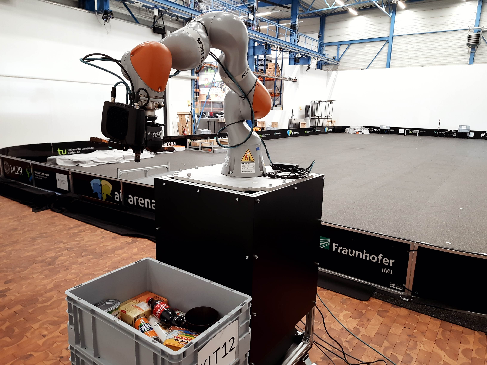
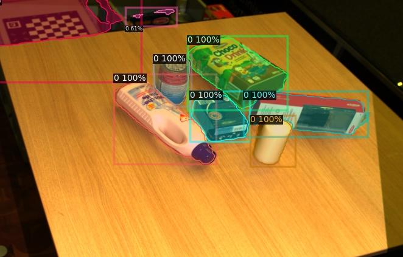

# ML2R segmentation and pose estimation dataset collector

This repository include the dataset collection scripts for [ML2R](https://www.ml2r.de/) segmentation and pose estimation real dataset.

The dataset includes different types of annotations:
- For each bin scene, multiple shots (3-5) are taken from different positions and angles.
- Each shot includes RGB-D image, segmentaiton mask, Point cloud, cloud annotation, 6D pose for all objects and transformations of the scene.
- Also the data includes an assembled point cloud from the different cloud shots. This cloud was used to boost the annotation process [<2 min per sample/n-images]. The annotation tool can be found [here](https://github.com/FLW-TUDO/3d_annotation_tool). Also this would allow the data to be used for 3D CNN training.
- 3D Mesh for each object in the dataset

### The samples

The dataset contains two types of scene, bin and table.

This is an illustration of what each sample consist of:
This image for a scene take fro 3 images where first raw is RGB, second is depth, third is segmentation masks and fourth is the dense point cloud from the 3D camera. As mentioned above, 6D pose, assembled point cloud and scene transformations are also included in the sample

# Trained CNN inference on this data
We trained a CNN for object agnostic segmentation. This next image is the result of the inference on one of the samples in this data.

All the false detections are coming from the background, which can easily be masked out form the image.

The whole dataset will be released around end of November 2022. [This folder](https://tu-dortmund.sciebo.de/s/sncfv4ewSyblVtv) contains some of the samples. To get the whole dataset before the full release, then please contact [me](mailto:anas.gouda@tu-dortmund.de).

The whole pipeline for efficient classification and pose estimation of varying number of classes based on class agnostic segmentation will be added here soon.